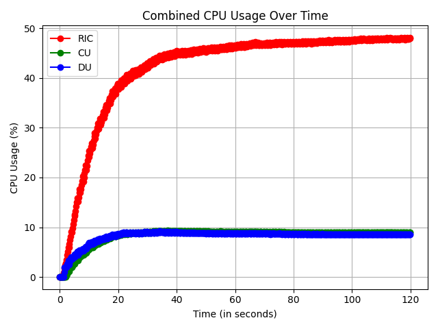
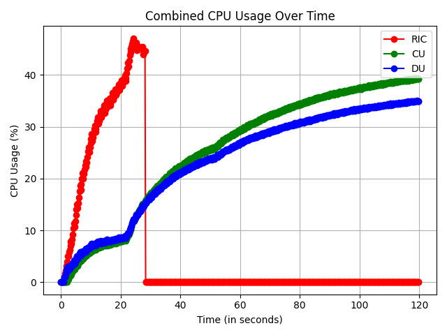

# FlexRIC Subscription DoS Attack

This repository contains the code necessary to replicate results presented in our paper "Endless Subscriptions: Open RAN is Open to RIC E2 Subscription Denial of Service Attacks".

## Abstract

> Telecommunication services are essential in ensuring the operation of numerous critical infrastructures. While mobile network security increased with the advancement of generations, emerging concepts such as the Open Radio Access Network (O-RAN) are transforming the traditional operation of Radio Access Networks (RANs). Novel concepts and technologies are finding their way into RANs with a focus on softwareization and virtualization. This increases the overall attack surface and introduces new attack vectors not necessarily found in traditional RANs. This paper, shows that Denial of Service (DoS) attacks leveraging subscription mechanisms can compromise O-RAN implementations. We present a novel DoS attack targeting the Near Real-Time (Near-RT) RAN Intelligent Controller (RIC). By deploying a malicious xApp, we demonstrate how an adversary can flood the Near-RT RIC with excessive subscription requests, leading to service disruption. This attack exploits the lack of rate-limiting mechanisms within the Service Model (SM), a critical component of the Near-RT RIC responsible for handling E2 subscription requests. We systematically evaluate various attack scenarios and investigate the underlying vulnerabilities exposed. Furthermore, we propose and assess countermeasures to safeguard publicly accessible O-RAN systems from such threats.

A detailed description as well as the findings of the investigation can be found in the [paper]().

## Overview

With this repo it is possible to perform the E2 Subscription DoS attack on the FlexRIC Near-RT RIC implementation.  
There are two execution modes, which save their results or logs under the following order structure:

```shell
dos
├── logs
│   └── 2025-03-26_11-20-27
│       ├── dos_xApp.log
│       ├── gnb_cu.log
│       ├── gnb_du.log
│       └── nearRT.log
├── measurements
│   └── 2025-03-26_11-20-27
│       ├── combined_cpu_usage.png
│       ├── cpu_usage.txt
│       ├── gtp.txt
│       ├── kpm_moni.txt
│       ├── mac.txt
│       ├── pdcp.txt
│       └── rlc.txt
```

## Requirements

In order to run the experiments, `make`, `docker` and `docker compose` must be installed. Installation instructions for docker can be found here: https://docs.docker.com/compose/install/

To install `make` you can use the following:

Linux:

```shell
sudo apt-get -y install make
```

MacOS:

```shell
brew install make
```

Windows:

```shell
choco install make
```

## Baseline Measurement

To execute the baseline measurement without executing the DoS script, you can either build and execute the container using `docker compose` or using:

```shell
make baseline
```

You should then find the corresponding measurement logs data and the following CPU usage plot as a png under measurements.



## DoS Attack

To carry out the actual attack, you can either run everything separately using `docker compose` as above or use the `make` command:

```shell
make dos
```

You should then also find the corresponding measurement data and the following CPU usage diagram as a png under measurements as well as all other logs, similar to the baseline measurement case.



## DoS Prevention

If our implemented DoS prevention wants to be tested, the argument `DOS_PREV_ENABL` must be set from `0` (disabled)(default) to `1` (enabled)

### For the DoS Attack

```bash
make dos DOS_PREV_ENABL=1
```

### For the Baseline

```bash
make baseline DOS_PREV_ENABL=1
```

## Citation

The paper will be published in the 2025 IEEE 10th European Symposium on Security and Privacy (EuroS&P). As soon as a full bibtex citation is available, it will be included here.

If you use the provided code, please cite it as:

```bibtex
@inproceedings{klement2025e2dos,
  author    = {Klement, Felix and Brighente, Alessandro and Bhattacharjee, Anup Kiran and Cecconello, Stefan and Kuipers, Fernando and Smaragdakis, Georgios and Conti, Mauro and Katzenbeisser, Stefan},
  booktitle = {2025 IEEE 10th European Symposium on Security and Privacy (EuroS\&P)},
  title     = {Endless Subscriptions: Open RAN is Open to RIC E2 Subscription Denial of Service Attacks},
  year      = {2025},
  volume    = {},
  number    = {}
}

```

## Release notes

See the [changelog](CHANGELOG.md) for changes between versions.


